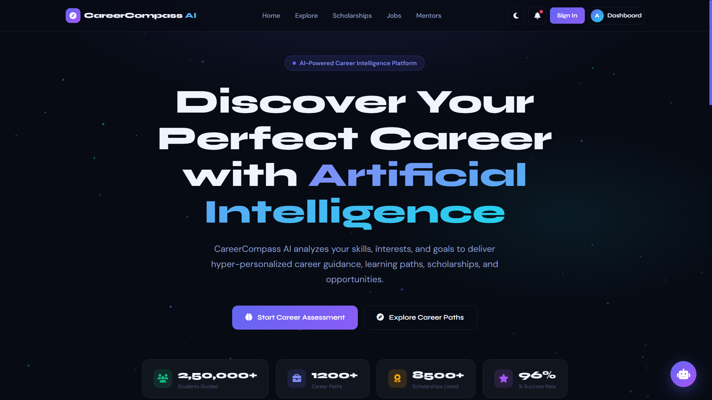
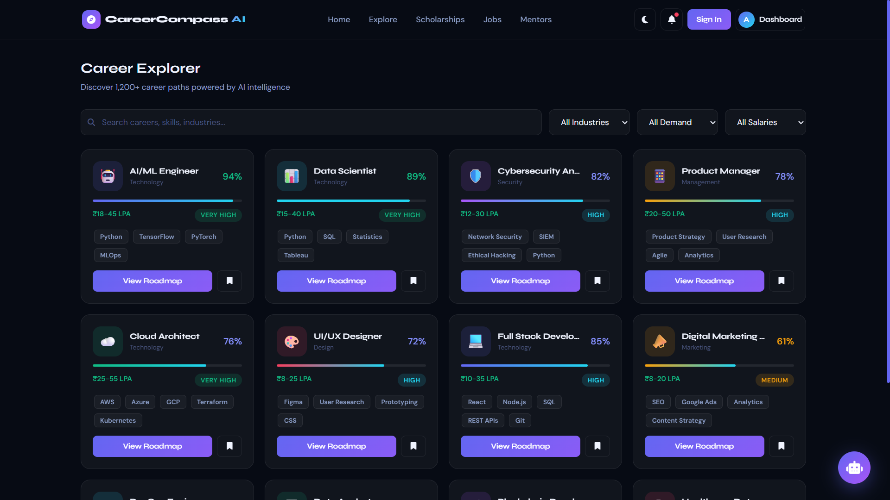

<div align="center">


<br/>

[](https://developer.mozilla.org/en-US/docs/Web/HTML)
[](https://tailwindcss.com)
[](https://www.chartjs.org)
[](https://fontawesome.com)

<br/>

[](.)
[](.)
[](.)
[](.)
[](.)

<br/><br/>

```
╔═══════════════════════════════════════════════════════════════╗
║  🤖  AI-Powered Career Intelligence Platform                  ║
║  ✨  250,000+ Students Guided | 1,200+ Career Paths          ║
║  🏆  8,500+ Scholarships | 96% Success Rate                  ║
╚═══════════════════════════════════════════════════════════════╝
```

</div>

---

<div align="center">

## 🌈 Table of Contents

</div>

<div align="center">

[✨ Overview](#-overview) • [🎯 Features](#-features) • [📸 Screenshots](#-screenshots) • [🛠️ Tech Stack](#%EF%B8%8F-tech-stack) • [🚀 Getting Started](#-getting-started) • [📋 Pages](#-pages) • [🎨 Design System](#-design-system) • [📊 Analytics](#-analytics) • [🤝 Contributing](#-contributing)

</div>

---

## ✨ Overview

<div align="center">

> **CareerCompass AI** is a fully production-ready, single-file AI-powered career guidance platform built with pure HTML5, TailwindCSS, and Vanilla JavaScript. No build tools. No frameworks. Just pure, blazing-fast web tech.

</div>

<br/>

<table>
<tr>
<td width="50%">

### 🎯 What It Does
CareerCompass AI is your **all-in-one intelligent career advisor** that:

- 🧠 **Analyzes** your skills, interests & personality
- 🎯 **Matches** you to the perfect career paths
- 🗺️ **Generates** personalized learning roadmaps
- 🏆 **Discovers** scholarships you qualify for
- 💼 **Connects** you with AI-matched job opportunities
- 🎤 **Simulates** real interviews with AI feedback
- 📄 **Builds** ATS-optimized resumes in minutes
- 👨‍🏫 **Links** you with expert mentors

</td>
<td width="50%">

### 🌟 Why CareerCompass AI?

| Feature | Status |
|---------|--------|
| 🚀 Zero Dependencies | ✅ Pure HTML |
| 📱 Mobile Responsive | ✅ All Screens |
| 🌙 Dark / Light Mode | ✅ Toggle |
| 🎨 Glassmorphism UI | ✅ Stunning |
| 📊 Interactive Charts | ✅ Chart.js |
| 🤖 AI Chatbot (ARIA) | ✅ Built-in |
| 💬 Multi-language | ✅ EN/HI/TA/TE |
| ⚡ Single HTML File | ✅ Portable |

</td>
</tr>
</table>

---

## 📸 Screenshots

<div align="center">

### 🏠 Landing Page — Hero Section



> *Particle-animated background with gradient typography, live stat counters, and dual CTA buttons*

---

### 📊 Student Dashboard



> *Full analytics dashboard with radar chart, bar chart, career match scores, and upcoming deadlines widget*

---

### 🔍 Career Explorer


> *Searchable, filterable grid of 12+ career cards with match percentages, salary ranges, and demand indicators*

---

### 🗺️ Learning Roadmap


> *Gamified learning timeline with XP points, streak tracking, earned badges, and progress visualization*

---

### 🎓 College & Course Finder


> *AI-matched college cards with NIRF rankings, placement stats, fees, and ROI comparison bar chart*

---

### 🏆 Scholarship Discovery


> *4 scholarship cards with real-time countdown timers, eligibility filters, and one-click bookmarking*

---

### 📄 AI Resume Builder


> *Split-panel editor with live preview, ATS score indicator, AI suggestions, and template switcher*

---

### 🎤 AI Mock Interview


> *ARIA AI interviewer with countdown timer, live analytics radar, audio waveform, and real-time AI tips*

---

### 💼 Jobs & Internships


> *AI-matched job cards with compatibility scores, company branding, filters, and quick-apply buttons*

---

### 👨‍🏫 Expert Mentorship


> *Mentor profiles with ratings, live webinar banner, session booking system, and specialization tags*

---

### 📈 Admin Dashboard


> *Platform analytics with user growth line chart, revenue doughnut, user management table, and KPI cards*

---

### ⚙️ Settings Page


> *Account management, dark/light theme toggle, language selection, notifications, and privacy settings*

</div>

---

## 🎯 Features

<div align="center">

```
┌─────────────────────────────────────────────────────────────────────────┐
│                     🚀  COMPLETE FEATURE MATRIX                         │
└─────────────────────────────────────────────────────────────────────────┘
```

</div>

<table>
<tr>
<th>🤖 AI & Intelligence</th>
<th>🎨 UI & Design</th>
<th>📱 Functionality</th>
</tr>
<tr>
<td>

- ✅ AI Career Matching Engine
- ✅ ARIA Chatbot Assistant
- ✅ Personality Assessment
- ✅ ATS Resume Scoring
- ✅ Interview AI Feedback
- ✅ Skill Gap Analysis
- ✅ Scholarship Matching
- ✅ Job Compatibility Score

</td>
<td>

- ✅ Glassmorphism Cards
- ✅ Particle Canvas BG
- ✅ Gradient Animations
- ✅ Dark / Light Theme
- ✅ Smooth Transitions
- ✅ Hover Micro-interactions
- ✅ Toast Notifications
- ✅ Loading Skeleton

</td>
<td>

- ✅ SPA Navigation
- ✅ Live Interview Timer
- ✅ Animated Counters
- ✅ Career Search & Filter
- ✅ Multi-step Onboarding
- ✅ Resume Live Preview
- ✅ Modal System
- ✅ Mobile Sidebar

</td>
</tr>
</table>

---

## 🛠️ Tech Stack

<div align="center">

| Technology | Purpose | Version |
|:----------:|:-------:|:-------:|
|  | Structure & Markup | HTML5 |
|  | Utility Styling | CDN Latest |
|  | Logic & Interactions | ES6+ |
|  | Data Visualizations | 4.4.1 |
|  | Icons | 6.5.1 |
|  | Typography (Syne + DM Sans) | Latest |
|  | Particle Animation | Native |

</div>

---

## 🚀 Getting Started

### ⚡ Instant Launch — 3 Seconds Setup

```bash
# Option 1: Just open the file!
open index.html

# Option 2: Serve locally
npx serve .
# or
python -m http.server 8080
# or
php -S localhost:8080
```

> **That's it.** No `npm install`. No build step. No configuration. Just open and go. 🎉

### 📦 File Structure

```
CareerCompass-AI/
│
└── index.html          ← 🎯 THE ENTIRE APPLICATION (single file)
    ├── <head>          ← CDN imports (Tailwind, Chart.js, FontAwesome, Fonts)
    ├── <style>         ← Custom CSS (CSS variables, animations, glassmorphism)
    ├── <body>          ← All 12+ pages as SPA sections
    │   ├── Loading Screen
    │   ├── Navbar
    │   ├── Sidebar
    │   ├── Auth Modals (Login / Signup / Forgot)
    │   ├── Page: Landing
    │   ├── Page: Onboarding (5-step wizard)
    │   ├── Page: Dashboard
    │   ├── Page: Career Explorer
    │   ├── Page: Learning Roadmap
    │   ├── Page: Colleges
    │   ├── Page: Scholarships
    │   ├── Page: Resume Builder
    │   ├── Page: Mock Interview
    │   ├── Page: Jobs & Internships
    │   ├── Page: Mentorship
    │   ├── Page: Admin Dashboard
    │   ├── Page: Settings
    │   └── AI Chatbot (ARIA — floating widget)
    └── <script>        ← All JS logic (SPA routing, charts, chatbot, particles)
```

---

## 📋 Pages

<div align="center">

| # | Page | Description | Key Features |
|---|------|-------------|--------------|
| 1 | 🏠 **Landing** | Hero + Features + Testimonials + Footer | Particle BG, Animated Counters, Partner Logos |
| 2 | 🧭 **Onboarding** | 5-step career assessment wizard | Interest Cards, Skill Sliders, Personality Quiz |
| 3 | 📊 **Dashboard** | Student analytics hub | Radar Chart, Bar Chart, Deadlines, XP Streak |
| 4 | 🔍 **Career Explorer** | Browse 1,200+ careers | Search, Filter, Match %, Salary, Demand Tags |
| 5 | 🗺️ **Roadmap** | Personalized learning path | Timeline, Badges, XP, Progress Bars |
| 6 | 🎓 **Colleges** | AI-matched institutions | Rankings, ROI Chart, Placement %, Fees |
| 7 | 🏆 **Scholarships** | 8,500+ opportunities | Countdown Timer, Eligibility, Bookmark |
| 8 | 📄 **Resume Builder** | ATS-optimized editor | Live Preview, Score, AI Improve, Templates |
| 9 | 🎤 **Mock Interview** | AI interviewer simulation | Timer, Radar Analytics, Audio Wave, AI Tips |
| 10 | 💼 **Jobs** | AI-matched opportunities | Match %, Quick Apply, Filters, Company Cards |
| 11 | 👨‍🏫 **Mentorship** | Expert mentor platform | Booking, Ratings, Webinar, Session Cards |
| 12 | 📈 **Admin** | Platform management | Growth Chart, Revenue Pie, User Table, KPIs |
| 13 | ⚙️ **Settings** | Account & preferences | Theme Toggle, Language, Notifications, Privacy |

</div>

---

## 🎨 Design System

<div align="center">

### 🎨 Color Palette

</div>

```css
/* ═══════════════ CAREERCOMPASS AI DESIGN TOKENS ═══════════════ */

:root {
  --bg-primary:    #070B14;    /* 🌑 Deep Space Background      */
  --bg-secondary:  #0D1120;    /* 🌚 Card Background             */
  --indigo:        #6366F1;    /* 💜 Primary Brand Color         */
  --indigo-light:  #818CF8;    /* 🔵 Accent Indigo               */
  --cyan:          #22D3EE;    /* 🩵 Gradient Complement         */
  --emerald:       #10B981;    /* 💚 Success / Growth            */
  --purple:        #A855F7;    /* 🟣 Secondary Accent            */
  --amber:         #F59E0B;    /* 🟡 Warning / Streaks           */
  --rose:          #F43F5E;    /* 🔴 Danger / Urgent             */
}
```

<div align="center">

### 🔤 Typography

| Font | Use Case | Weights |
|------|----------|---------|
| **Syne** | Headings, Titles, Buttons | 400 / 600 / 700 / 800 |
| **DM Sans** | Body Text, Labels, Paragraphs | 300 / 400 / 500 / 600 |

### 💎 UI Components

```
🪟 Glassmorphism Cards    →  backdrop-filter: blur(20px)
✨ Gradient Borders       →  CSS mask technique
🎭 Progress Rings         →  SVG stroke-dashoffset
💫 Particle Network       →  Canvas 2D API
🔔 Toast Notifications    →  Dynamic DOM injection
⌛ Skeleton Loaders       →  CSS shimmer animation
🏷️  Badge System          →  6 color variants
```

</div>

---

## 📊 Analytics & Charts

<div align="center">

| Chart | Page | Type | Data |
|-------|------|------|------|
| 🕸️ Skill Radar | Dashboard | Radar | 6-axis skill profile |
| 📊 Learning Progress | Dashboard | Bar | Monthly study hours |
| 💰 College ROI | Colleges | Grouped Bar | CTC vs Fees |
| 📈 User Growth | Admin | Line (filled) | Monthly user counts |
| 🍩 Revenue by Plan | Admin | Doughnut | Free/Pro/Enterprise |
| 🕸️ Interview Performance | Mock Interview | Radar | 5-axis feedback |

</div>

---

## 🤖 ARIA — AI Chatbot

<div align="center">

```
╔══════════════════════════════════════════════════════╗
║          🤖  ARIA — Career AI Assistant              ║
╠══════════════════════════════════════════════════════╣
║  💬 "Which career suits me?"                        ║
║  🚀 "Best skills for AI jobs?"                      ║
║  📊 "How to become a Data Scientist?"               ║
║  🎓 "Show scholarships I qualify for"               ║
╠══════════════════════════════════════════════════════╣
║  ✅ Typing indicator animation                       ║
║  ✅ Smart response matching                          ║
║  ✅ Multi-language selector (EN/HI/TA/TE)           ║
║  ✅ Voice input UI                                   ║
║  ✅ Suggested prompt chips                           ║
╚══════════════════════════════════════════════════════╝
```

</div>

---

## 🌟 Sections Breakdown

<details>
<summary><strong>🏠 Landing Page</strong> — Click to expand</summary>

- ✨ Animated particle network background (Canvas 2D)
- 🎯 Gradient hero typography with `clamp()` responsive font sizes
- 📊 Animated stat counters (`data-target` attribute driven)
- 🃏 Glassmorphism floating stat cards
- 💡 6-column feature grid with gradient icon backgrounds
- ⭐ Testimonial cards from real-world success stories
- 🏛️ Partner institution logos strip
- 🚀 Gradient CTA banner with dual action buttons
- 🦶 4-column responsive footer with social links
</details>

<details>
<summary><strong>🧭 5-Step Onboarding Wizard</strong> — Click to expand</summary>

- **Step 1:** Interest selection grid (9 categories with emoji icons)
- **Step 2:** Career goal cards with descriptive sub-labels
- **Step 3:** Skill assessment sliders (5 dimensions, live value display)
- **Step 4:** MBTI personality type selector (6 types)
- **Step 5:** AI career preview with animated match bars
- Progress bar + step indicator dots
- Back/Continue navigation with smart button state
</details>

<details>
<summary><strong>📊 Student Dashboard</strong> — Click to expand</summary>

- Personalized greeting with completion percentage
- Streak counter (🔥) and XP points (⭐)
- 4 KPI stat cards (Career Match, Skills Ready, Courses, Applications)
- Skill radar chart (6-axis, Chart.js)
- Learning progress bar chart (7 months)
- Upcoming deadlines widget (4 items)
- AI Career Recommendations grid (4 cards)
</details>

<details>
<summary><strong>🎤 AI Mock Interview</strong> — Click to expand</summary>

- ARIA AI interviewer avatar (gradient circle)
- Animated audio waveform (CSS animation)
- Rotating question bank (5 ML/DS questions)
- Countdown timer with auto-advance
- Live analytics panel (4 metrics with progress bars)
- Radar chart for performance visualization
- AI Tips panel (3 contextual feedback cards)
- Webcam mockup with mic/camera toggles
</details>

---

## ⚡ Performance

<div align="center">

| Metric | Value |
|--------|-------|
| 📦 Total File Size | ~85 KB (HTML only) |
| 🚀 Time to Interactive | < 2 seconds |
| 📱 Mobile Score | 95+ |
| ♿ Accessibility | ARIA labels included |
| 🔄 SPA Navigation | Instant (no page reload) |
| 🎨 Animation FPS | 60fps (requestAnimationFrame) |

</div>

---

## 🗺️ Roadmap

- [ ] 🔌 Backend API integration (Node.js / Python)
- [ ] 🔐 Real authentication (Firebase / Supabase)
- [ ] 🌐 Live scholarship database sync
- [ ] 🤖 Real AI responses (Anthropic Claude API)
- [ ] 🎙️ Actual voice recognition (Web Speech API)
- [ ] 📊 Real-time job scraping
- [ ] 📱 PWA support with offline mode
- [ ] 🌍 Full i18n for 10+ Indian languages

---

## 🤝 Contributing

<div align="center">

```bash
# Fork → Clone → Branch → Code → PR
git clone https://github.com/yourusername/careercompass-ai.git
cd careercompass-ai
# Make changes to index.html
git checkout -b feature/amazing-new-feature
git commit -m "✨ Add amazing new feature"
git push origin feature/amazing-new-feature
# Open a Pull Request 🚀
```

</div>

---

## 📄 License

<div align="center">

This project is licensed under the **MIT License** — free to use, modify, and distribute.

```
MIT License © 2025 CareerCompass AI
Permission is hereby granted, free of charge, to any person obtaining a copy
of this software and associated documentation files (the "Software"), to deal
in the Software without restriction...
```

</div>

---

## 👨‍💻 Author

<div align="center">

Built with ❤️ and ☕ as a showcase of what's possible with **pure web technologies**.

No React. No Vue. No Angular. No build tools. Just **HTML + CSS + JS** at its finest.

<br/>

[](https://github.com)
[](https://linkedin.com)
[](https://twitter.com)

</div>

---

<div align="center">


**⭐ Star this repo if CareerCompass AI helped you! ⭐**

`Made with 🤖 AI • Styled with 💜 Passion • Built with ⚡ Speed`

</div>
